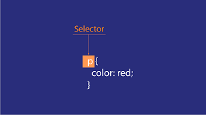

    
    <h1 align="center">Introduction to CSS Selectors</h1>

## 📝 Description
> CSS selectors are used to "find" (or select) the HTML elements you want to style.

## 📋 Prerequisites
- [ ] [Introduction to HTML and HTML5](https://github.com/Kick-StartDev/web-development-basic-curriculum/blob/responsive-web-design/responsive-web-design/introduction-to-html-and-html5.md).
- [ ] [Introduction to CSS and Basic CSS](https://github.com/Kick-StartDev/web-development-basic-curriculum/blob/responsive-web-design/responsive-web-design/introduction-to-css-and-basic-css.md).
- [ ] [Introduction to CSS Colors](https://github.com/Kick-StartDev/web-development-basic-curriculum/blob/responsive-web-design/responsive-web-design/introduction-to-css-colors.md).
- [ ] [Introduction to HTML Forms](https://github.com/Kick-StartDev/web-development-basic-curriculum/blob/responsive-web-design/responsive-web-design/introduction-to-html-forms.md).
- [ ] [Introduction to CSS Box Model](https://github.com/Kick-StartDev/web-development-basic-curriculum/blob/responsive-web-design/responsive-web-design/introduction-to-css-box-model.md).
- [ ] [Introduction to CSS Flexbox](https://github.com/Kick-StartDev/web-development-basic-curriculum/blob/responsive-web-design/responsive-web-design/introduction-to-css-flexbox.md).
- [ ] [Introduction to Typography](https://github.com/Kick-StartDev/web-development-basic-curriculum/blob/responsive-web-design/responsive-web-design/introduction-to-typography.md).
- [ ] [Introduction to Accessibility](https://github.com/Kick-StartDev/web-development-basic-curriculum/blob/responsive-web-design/responsive-web-design/introduction-to-accessibility.md).

## 🎯 Learning Objectives
- [ ] Understand the basic structure of CSS selectors.
- [ ] Basic understanding of CSS selectors properties.
- [ ] Basic understanding of CSS selectors properties values.

## 📹 Video

- Please watch the following videos:
    - [CSS Selectors](https://www.youtube.com/watch?v=Z07d9Vu7GKM)

    

## 🔧 Instructions
- If you don't have an account on [freecodecamp](https://www.freecodecamp.org), please create one and familiarize yourself with the platform.
Then complete all the challenges provided in the excerises section below and submit your work.

## 🚀 Excersises
- Please complete the following excersises:
    - [ ] [Learn More About CSS Pseudo Selectors by Building a Balance Sheet](https://www.freecodecamp.org/learn/2022/responsive-web-design/learn-more-about-css-pseudo-selectors-by-building-a-balance-sheet/step-1)

## 📫 Submittion
- After completing the excersises, please fill in the following form and submit your work so that we can know your progress:
    - [Submittion Form](https://airtable.com/shrTKszJIyALWIPnb).

    

        <h2>📌 Additional Materials</h2>
    

    

    <i>
        These are all optional, but if you're interested in exploring this topic further, here are some resources to help you.
    </i>

 
    <ul>
        <li><a href="https://www.w3schools.com/css/css_selectors.asp" target="_blank">CSS Selectors</a></li>
        <li><a href="https://www.youtube.com/watch?v=l1mER1bV0N0" target="_blank">CSS Selectors</a></li>
        <li><a href="https://www.youtube.com/watch?v=9DCpQG1KVGk" target="_blank">How to use freecodecamp</a></li>
    </ul>

------

_If you spot any bugs or issues in this activity, you can [open an issue with your proposed change](https://github.com/Kick-StartDev/web-development-basic-curriculum/issues/new)_