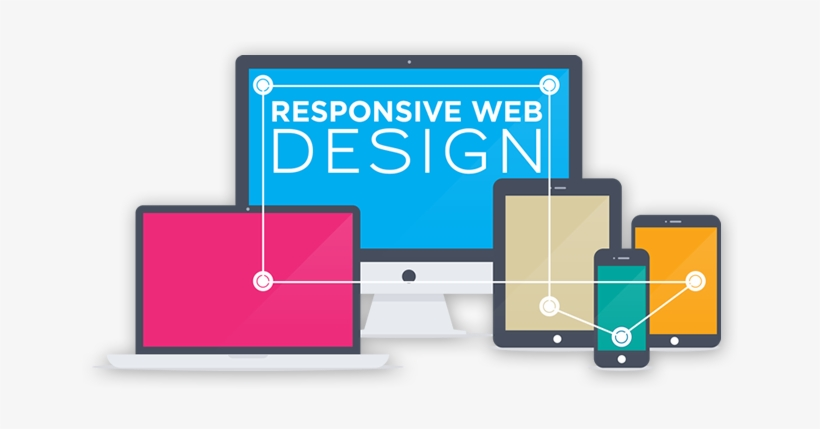

    
    <h1 align="center">Responsive Web Design</h1>

## 📝 Description
> Responsive web design is an approach to web design that makes web pages render well on a variety of devices and window or screen sizes from minimum to maximum display size. Recent work also considers the viewer proximity as part of the viewing context as an extension for RWD. Content, design and performance are necessary across all devices to ensure usability and satisfaction.

## 📋 Prerequisites
- [ ] [Introduction to HTML and HTML5](https://github.com/Kick-StartDev/web-development-basic-curriculum/blob/responsive-web-design/responsive-web-design/introduction-to-html-and-html5.md).
- [ ] [Introduction to CSS and Basic CSS](https://github.com/Kick-StartDev/web-development-basic-curriculum/blob/responsive-web-design/responsive-web-design/introduction-to-css-and-basic-css.md).
- [ ] [Introduction to CSS Colors](https://github.com/Kick-StartDev/web-development-basic-curriculum/blob/responsive-web-design/responsive-web-design/introduction-to-css-colors.md).
- [ ] [Introduction to HTML Forms](https://github.com/Kick-StartDev/web-development-basic-curriculum/blob/responsive-web-design/responsive-web-design/introduction-to-html-forms.md).
- [ ] [Introduction to CSS Box Model](https://github.com/Kick-StartDev/web-development-basic-curriculum/blob/responsive-web-design/responsive-web-design/introduction-to-css-box-model.md).
- [ ] [Introduction to CSS Flexbox](https://github.com/Kick-StartDev/web-development-basic-curriculum/blob/responsive-web-design/responsive-web-design/introduction-to-css-flexbox.md).
- [ ] [Introduction to Typography](https://github.com/Kick-StartDev/web-development-basic-curriculum/blob/responsive-web-design/responsive-web-design/introduction-to-typography.md).
- [ ] [Introduction to Accessibility](https://github.com/Kick-StartDev/web-development-basic-curriculum/blob/responsive-web-design/responsive-web-design/introduction-to-accessibility.md).
- [ ] [Introduction to CSS Selectors](https://github.com/Kick-StartDev/web-development-basic-curriculum/blob/responsive-web-design/responsive-web-design/intrduction-to-css-selectors.md).
- [ ] [Intermediate CSS Concepts](https://github.com/Kick-StartDev/web-development-basic-curriculum/blob/responsive-web-design/responsive-web-design/introduction-to-css-selectors.md).

## 🎯 Learning Objectives
- [ ] Understand the basic structure of responsive web design.
- [ ] Basic understanding of responsive web design properties.
- [ ] Basic understanding of responsive web design properties values.

## 📹 Video

- Please watch the following videos:
    - [Responsive Web Design](https://www.youtube.com/watch?v=oNSX21dh6kw")

    

## 🔧 Instructions
- If you don't have an account on [freecodecamp](freecodecamp.org), please create one and familiarize yourself with the platform.
Then complete all the challenges provided in the excerises section below and submit your work.

## 🚀 Excersises
- Please complete the following excersises:
    - [ ] [Learn Responsive Web Design by Building a Piano](https://www.freecodecamp.org/learn/2022/responsive-web-design/learn-responsive-web-design-by-building-a-piano/step-1)

## 📫 Submittion
- After completing the excersises, please fill in the following form and submit your work so that we can know your progress:
    - [Submittion Form](https://airtable.com/shrTKszJIyALWIPnb).

    

        <h2>📌 Additional Materials</h2>
    

    

    <i>
        These are all optional, but if you're interested in exploring this topic further, here are some resources to help you.
    </i>

 
    <ul>
        <li><a href="https://www.w3schools.com/css/css_rwd_intro.asp" target="_blank">Responsive Web Design</a></li>
        <li><a href="https://www.youtube.com/watch?v=srvUrASNj0s" target="_blank">Responsive Web Design</a></li>
        <li><a href="https://www.youtube.com/watch?v=9DCpQG1KVGk" target="_blank">How to use freecodecamp</a></li>
    </ul>

------

_If you spot any bugs or issues in this activity, you can [open an issue with your proposed change](https://github.com/Kick-StartDev/web-development-basic-curriculum/issues/new)_